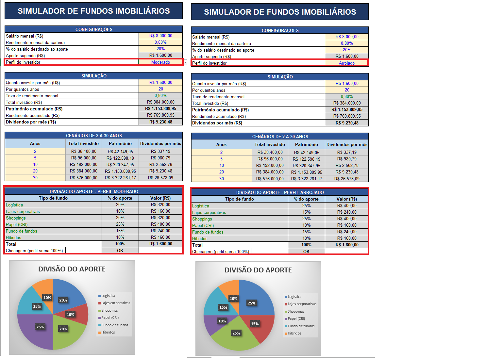

# Simulador de Fundos Imobiliários (FIIs)

## Objetivo

Este projeto apresenta uma ferramenta desenvolvida em Excel para simular investimentos em Fundos Imobiliários (FIIs).

A ferramenta permite informar salário, percentual destinado aos investimentos, taxa de rendimento mensal, prazo e perfil de investidor. A partir desses dados, são calculados o aporte mensal, o patrimônio acumulado, o retorno acumulado e os dividendos mensais estimados.

Também é possível visualizar a distribuição do aporte entre diferentes tipos de FIIs de acordo com o perfil selecionado.

## Estrutura da ferramenta

A planilha possui duas áreas principais.

A aba Simulador concentra os parâmetros de entrada, os resultados da simulação e a distribuição dos investimentos.

A aba Apoio contém as informações utilizadas para relacionar cada perfil de investidor aos respectivos tipos de FIIs e percentuais de distribuição.

## Parâmetros utilizados

Salário: R$ 8.000,00

Percentual destinado aos investimentos: 20%

Aporte mensal: R$ 1.600,00

Taxa de rendimento mensal: 0,80%

Prazo: 20 anos

## Cálculo do patrimônio

O patrimônio acumulado é calculado por meio da função VF do Excel, considerando o aporte mensal, a taxa de rendimento e o período definido para a simulação.

O total investido corresponde à soma dos aportes realizados durante o período.

O retorno acumulado corresponde à diferença entre o patrimônio acumulado e o total investido.

## Distribuição dos investimentos

A ferramenta trabalha com três perfis de investidor:

Conservador

Moderado

Arrojado

A distribuição do aporte mensal é realizada entre seis tipos de FIIs:

Logística

Lajes corporativas

Shoppings

Papel (CRI)

Fundo de fundos

Híbridos

Os percentuais são definidos de acordo com o perfil selecionado e totalizam 100% em cada cenário.

A busca dos percentuais é realizada automaticamente utilizando a função PROCV com uma chave composta pelo perfil e pelo tipo de fundo.

## Distribuição dos perfis

### Conservador

Logística: 15%

Lajes corporativas: 10%

Shoppings: 15%

Papel (CRI): 35%

Fundo de fundos: 15%

Híbridos: 10%

### Moderado

Logística: 20%

Lajes corporativas: 10%

Shoppings: 20%

Papel (CRI): 25%

Fundo de fundos: 15%

Híbridos: 10%

### Arrojado

Logística: 25%

Lajes corporativas: 15%

Shoppings: 25%

Papel (CRI): 10%

Fundo de fundos: 15%

Híbridos: 10%

## Projeções

A ferramenta permite analisar a evolução do investimento nos períodos de 2, 5, 10, 20 e 30 anos.

## Exemplo de simulação

Para demonstrar a alteração entre os perfis, foram mantidos os mesmos parâmetros e alterado apenas o perfil do investidor.

Com salário de R$ 8.000,00, aporte mensal de R$ 1.600,00, rendimento mensal de 0,80% e prazo de 20 anos, a simulação apresenta:

Total investido: R$ 384.000,00

Patrimônio acumulado: R$ 1.153.809,95

Retorno acumulado: R$ 769.809,95

Dividendos mensais estimados: R$ 9.230,48

A alteração do perfil modifica a distribuição do aporte entre os tipos de FIIs, mantendo os demais parâmetros da simulação.

## Desenvolvimento

A ferramenta mantém a estrutura de cálculo utilizada como referência no material do Expert e aplica adaptações nos parâmetros e na composição dos perfis utilizados nesta versão.

Foram utilizados os recursos de Excel necessários para automatizar os cálculos, relacionar os perfis aos tipos de FIIs e apresentar os resultados da simulação de forma visual.

## Resultado

O simulador permite avaliar diferentes cenários de investimento e visualizar como o prazo, o aporte, o rendimento e o perfil escolhido influenciam o patrimônio acumulado e os dividendos estimados.

## Observação

Os valores apresentados são resultados de uma simulação matemática baseada nos parâmetros informados na ferramenta. Não representam garantia de rentabilidade nem recomendação de investimento.
